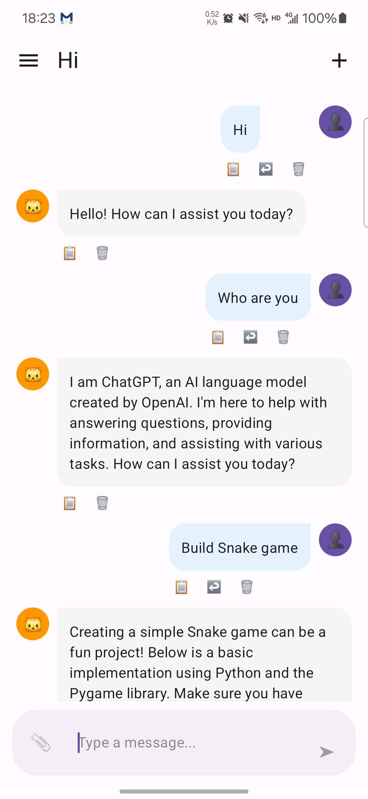
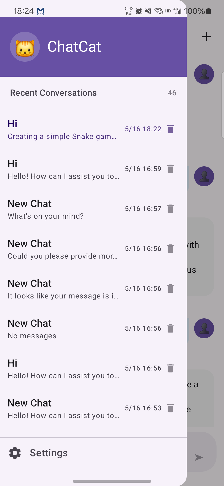
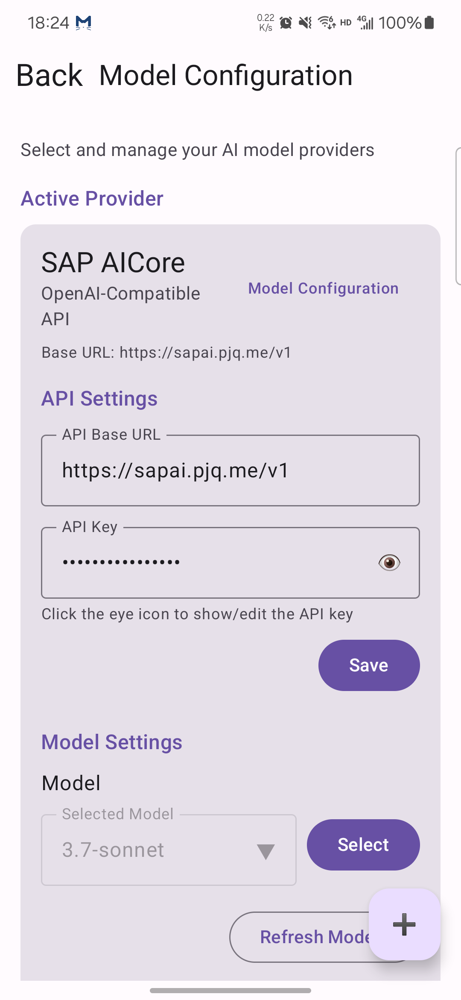
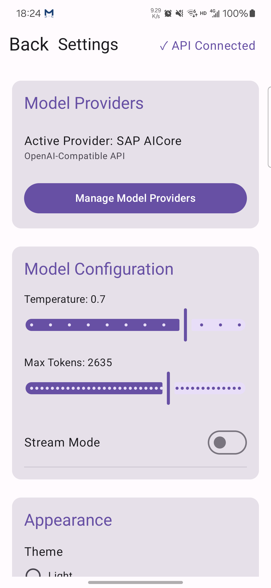

# ChatCat AI

ChatCat is a modern AI chat assistant built with Kotlin Multiplatform (Compose UI), offering an OpenAI-like experience across multiple platforms.

## Features

- **Intelligent Conversations** - Chat with an AI assistant that can answer questions, provide information, and help with various tasks
- **Cross-Platform Support** - Available on Android, iOS, Web (Wasm), and Desktop
- **Elegant UI** - Clean, intuitive interface with a cat-themed design
- **Markdown Support** - Rich text formatting with Markdown rendering
- **Conversation History** - Save and review past conversations
- **Copy & Resend** - Easily copy message content to clipboard or resend previous messages
- **Customizable Responses** - Adjust the AI's personality and response style
- **Dark/Light Mode** - Choose your preferred visual theme
- **Multiple Model Providers** - Support for OpenAI, Azure OpenAI, Anthropic, and other compatible APIs
- **Configurable API Settings** - Easily set up API keys, base URLs, and connection parameters for each provider
- **Preference Management** - Store and manage user settings across sessions and platforms
- **Internationalization (i18n)** - Support for multiple languages with easy language switching


## Project Structure

* `/composeApp` contains code shared across your Compose Multiplatform applications:
  - `commonMain` - Code common for all platforms
  - `androidMain` - Android-specific implementations
  - `iosMain` - iOS-specific implementations
  - `desktopMain` - Desktop (JVM) implementations
  - `wasmJsMain` - Web (Wasm) implementations

* `/iosApp` contains iOS application entry points and SwiftUI code.

## Getting Started

1. Clone the repository
2. Open the project in Android Studio or IntelliJ IDEA
3. Run the desired platform configuration:
   - For Android: Use the Android run configuration
   - For Desktop: Run the `:composeApp:desktopRun` Gradle task
     - ./gradlew desktopRun -PmainClass=me.pjq.chatcat.MainKt
   - For Web: Run the `:composeApp:wasmJsBrowserDevelopmentRun` Gradle task
   - For iOS: Open the Xcode project in the `/iosApp` directory

## Configuration

ChatCat supports various configuration options:

- **LLM Model Provider/API Configuration**: Set your LLM Model Provider Settings 
- **Chat Settings**: Customize temperature, max tokens, and other model parameters
- **UI Preferences**: Set theme, font size, and other display options
- **Language Settings**: Choose your preferred language from multiple supported options

These settings can be accessed through the settings screen in the app interface.

## Technology

ChatCat is built using:
- **Kotlin Multiplatform** - Share code across platforms
- **Compose Multiplatform** - UI framework for all platforms
- **Ktor** - HTTP client for API communication
- **OpenAI Client** - Kotlin client for OpenAI API
- **Kotlinx Serialization** - JSON parsing
- **Multiplatform Settings** - Cross-platform settings storage
- **PreCompose** - Navigation framework
- **Kotlinx Coroutines** - Asynchronous programming
- **Multiplatform Markdown Renderer** - Markdown rendering

## Building for Different Platforms

### Android
```
./gradlew :composeApp:assembleDebug
```

### iOS
Open the Xcode project in the `/iosApp` directory and build using Xcode.

### Desktop
```
./gradlew :composeApp:packageDistributionForCurrentOS
```
This will create platform-specific installers (DMG for macOS, MSI for Windows, DEB for Linux).

### Web (Wasm)
```
./gradlew :composeApp:wasmJsBrowserProductionWebpack
```
This will generate web assets in the `build/dist/wasmJs/productionExecutable` directory.

## Screenshots

### Chat Screen


### Conversation History


### Model Provider Settings


### Settings


## Internationalization (i18n)

ChatCat supports multiple languages through its internationalization system, allowing users to interact with the app in their preferred language.

### Supported Languages

- English (Default)
- Chinese (简体中文)
- Spanish (Español)
- Japanese (日本語)
- German (Deutsch)
- French (Français)

### Language Settings

You can change the app language in the Settings screen:

1. Navigate to the Settings screen
2. Scroll to the "Appearance" section
3. Select your preferred language from the dropdown menu
4. The app will immediately update to display text in the selected language

## Additional Resources

Learn more about:
- [Kotlin Multiplatform](https://www.jetbrains.com/help/kotlin-multiplatform-dev/get-started.html)
- [Compose Multiplatform](https://github.com/JetBrains/compose-multiplatform/#compose-multiplatform)
- [Kotlin/Wasm](https://kotl.in/wasm/)
- [OpenAI API](https://platform.openai.com/docs/api-reference)
- [MOKO Resources](https://github.com/icerockdev/moko-resources) - Kotlin Multiplatform i18n library

We would appreciate your feedback on Compose/Web and Kotlin/Wasm in the public Slack channel [#compose-web](https://slack-chats.kotlinlang.org/c/compose-web).
If you face any issues, please report them on [YouTrack](https://youtrack.jetbrains.com/newIssue?project=CMP).
