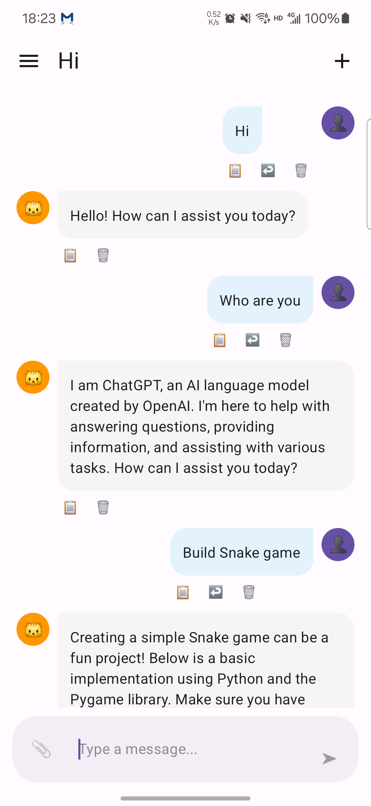
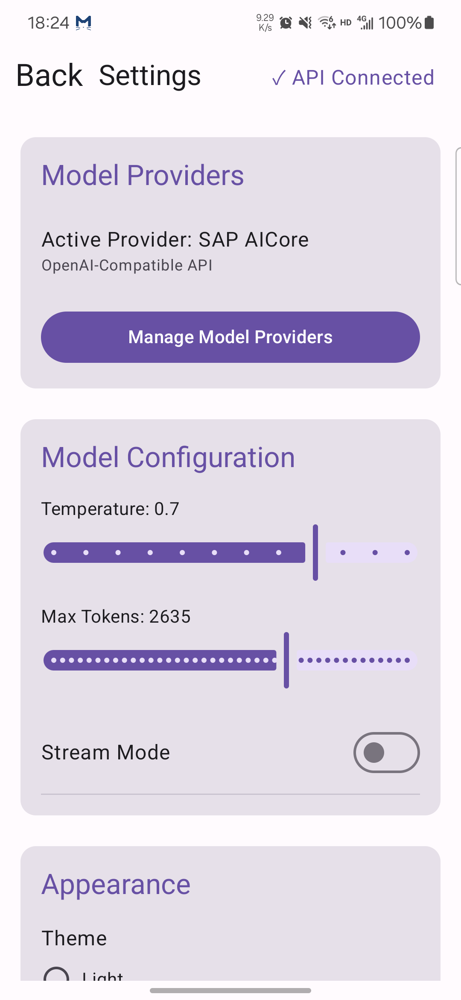
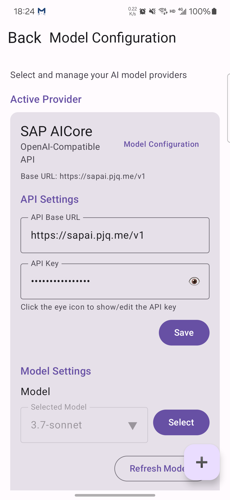

# ChatCat AI 2.0

A modern, multimodal AI chat client built with Kotlin Multiplatform and Compose. Android-first, with Desktop / iOS / Web (Wasm) sharing the same codebase.

## Features

- **Multi-provider** — OpenAI (GPT-5 series), Anthropic (Claude 4.x), Google (Gemini 2.5), Groq, Together AI, Ollama, LM Studio, or any OpenAI-compatible endpoint
- **Multimodal** — text + image attachments + image generation in one conversation
- **MCP (Model Context Protocol)** — connect external tool servers, expose their tools to the model automatically
- **Streaming** — real-time SSE responses with stop button
- **World-class Settings** — iOS-style grouped list, full-screen provider editor with connection testing, preset quick-start grid
- **Material 3** — five accent palettes + Android 12+ dynamic color, dark/light/system theme
- **Conversation management** — pinning, search, automatic title derivation, full v1→v2 migration
- **6 languages** — English, Chinese, Spanish, Japanese, German, French

## Quick Start

```bash
# Clone
git clone https://github.com/pjq/ChatCat.git && cd ChatCat

# Android
./gradlew :composeApp:assembleDebug

# Desktop
./gradlew :composeApp:desktopRun -PmainClass=me.pjq.chatcat.MainKt

# Web (Wasm)
./gradlew :composeApp:wasmJsBrowserDevelopmentRun
```

## Configuration

Open the app → Settings (gear icon in the drawer):

1. **Model** (top) — active provider, model, system prompt, streaming toggle
2. **Providers** — add/edit/test providers with the full-screen editor; presets for OpenAI, Anthropic, Gemini, Groq, Together, Ollama, LM Studio
3. **Appearance** — theme, accent color, dynamic color, font size, density, language
4. **Integrations** — MCP servers management
5. **Data** — clear conversations, reset to defaults

## Technology

| Layer | Stack |
|-------|-------|
| UI | Compose Multiplatform, Material 3, PreCompose navigation |
| Networking | Ktor (HTTP client, SSE streaming) |
| Serialization | kotlinx.serialization |
| Persistence | multiplatform-settings (JSON blob) |
| Images | Coil 3 (Android), Skia (Desktop) |
| Async | Kotlin Coroutines + Flow |
| Markdown | Multiplatform Markdown Renderer |

## Project Structure

```
composeApp/src/
├── commonMain/     # Shared code (model, service, viewmodel, UI)
├── androidMain/    # Android-specific (ImagePicker, PlatformImage, DynamicColor)
├── desktopMain/    # Desktop JVM (Skia image decoding)
├── iosMain/        # iOS stubs
└── wasmJsMain/     # Web stubs
iosApp/             # iOS entry point (SwiftUI)
```

## Supported Models

### OpenAI
gpt-5.5, gpt-5.4, gpt-5, gpt-5.3-codex, gpt-4o, gpt-4o-mini

### Anthropic
claude-4.7-opus, claude-4.6-opus, claude-4.6-sonnet, claude-4.5-sonnet, claude-4.5-opus

### Google
gemini-2.5-pro

### Local
Any model via Ollama or LM Studio (OpenAI-compatible API)

## Screenshots

| Chat | Settings | Provider Editor |
|------|----------|-----------------|
|  |  |  |

## License

MIT
